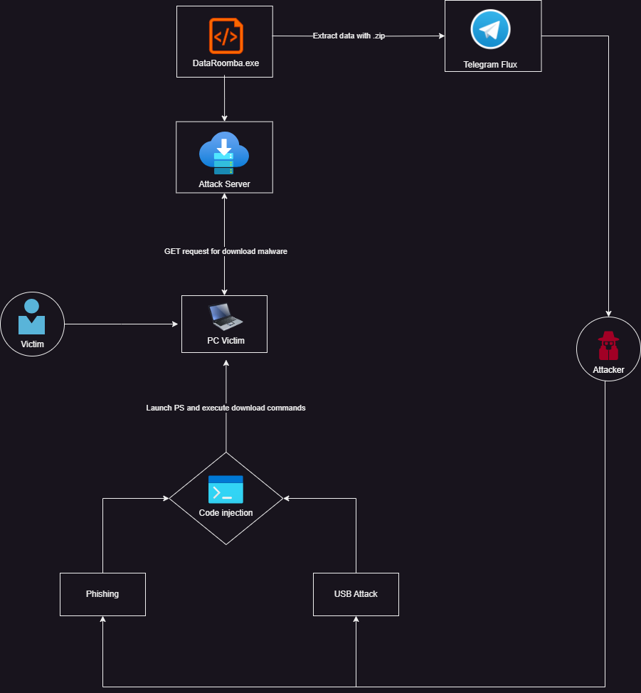

#  DataRoomba

<p align="center">
  
</p>

> ⚠️ DISCLAIMER: This project is intended **for educational purposes only**.  
> Do **not** use this tool on systems you do not own or have explicit permission to test.

<p><br></p>

---

<p><br></p>

## 📝 Description

**DataRoomba** is a proof-of-concept tool designed to demonstrate how attackers can collect sensitive data from a compromised system.  
This includes browser credentials, saved Wi-Fi passwords.  
The goal is to raise awareness and improve defenses through red team simulations.

<p><br></p>

---

<p><br></p>

## 🚀 Features

- 🔐 Extract saved browser passwords (Chrome, Edge, etc.)
- 📶 Retrieve saved Wi-Fi credentials
- 📤 Send collected data directly via Telegram
- 🧼 No local storage of files (everything is sent in-memory)
- 🌫️ Obfuscation - Basic anti-analysis techniques

<p><br></p>

---

<p><br></p>

## ⚙️ Requirements

- Python 3.x
- Packages:  
  `pycryptodome`, `requests`, `win32crypt` (or `cryptography`), `psutil`

```pip install -r requirements.txt```

<p><br></p>

---

<p><br></p>

## 📦 How to Use

1. **Configure Telegram**
   - Create a Telegram bot using [BotFather](https://t.me/botfather)
   - Retrieve your **bot token**
   - Start a chat with your bot and use [@get_id_bot](https://t.me/get_id_bot) to get your **chat ID**

2. **Edit the script**  
   Open the main Python script and replace the placeholders with your actual Telegram credentials:
   ```python
   TELEGRAM_TOKEN = "your_telegram_bot_token"
   CHAT_ID = "your_chat_id"

3. **Install dependcies**  
   ```pip install -r requirements.txt```

4. **Edit the script**  
   To compile into a standalone binary: ```pyinstaller --onefile dataroomba.py```

<p><br></p>

---

<p><br></p>

## 🎯 Attack Scenario

<p align="center">
  
</p>
<p><br></p>


